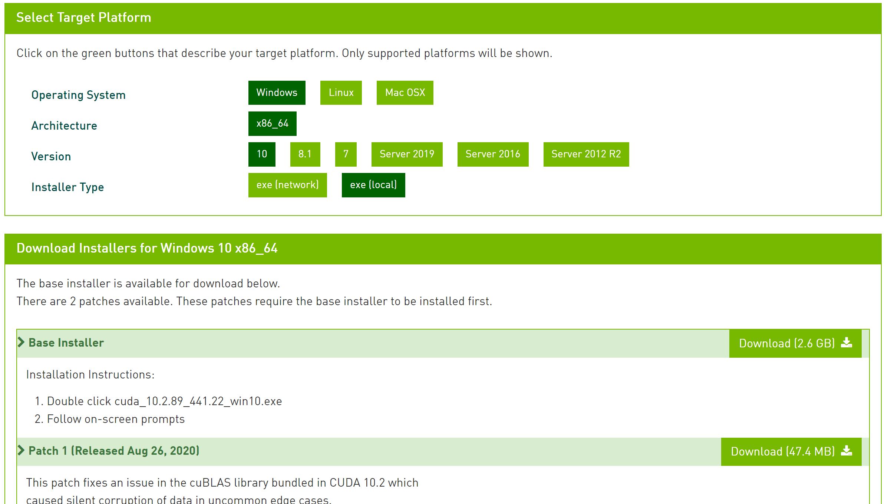

- [1. Linux(Ubuntu)](#1-linuxubuntu)
  - [1.1. 安装 cuda](#11-安装-cuda)
  - [1.2. 安装 cudnn](#12-安装-cudnn)
  - [1.3. 安装 anaconda](#13-安装-anaconda)
- [2. Windows 10](#2-windows-10)
  - [2.1. 安装 cuda](#21-安装-cuda)
  - [2.2. 安装 cudnn](#22-安装-cudnn)
  - [2.3. 安装 anaconda](#23-安装-anaconda)

# 1. Linux(Ubuntu)

## 1.1. 安装 cuda

## 1.2. 安装 cudnn

## 1.3. 安装 anaconda

# 2. Windows 10

## 2.1. 安装 cuda

首先需要查看本机显卡支持的 CUDA 版本，桌面右键-NVIDIA控制面板-帮助-系统信息-组件

可以看到最高支持到 CUDA 10.2，下面安装 CUDA 10.2，CUDA 的下载页面：https://developer.nvidia.com/cuda-toolkit-archive

下载 CUDA 10.2 完成后，按照安装指示一路安装

## 2.2. 安装 cudnn

## 2.3. 安装 anaconda